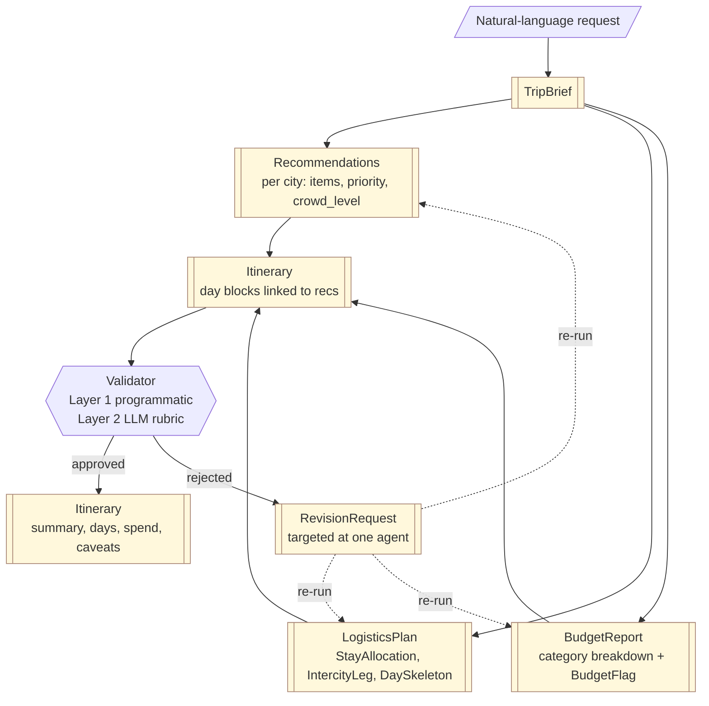
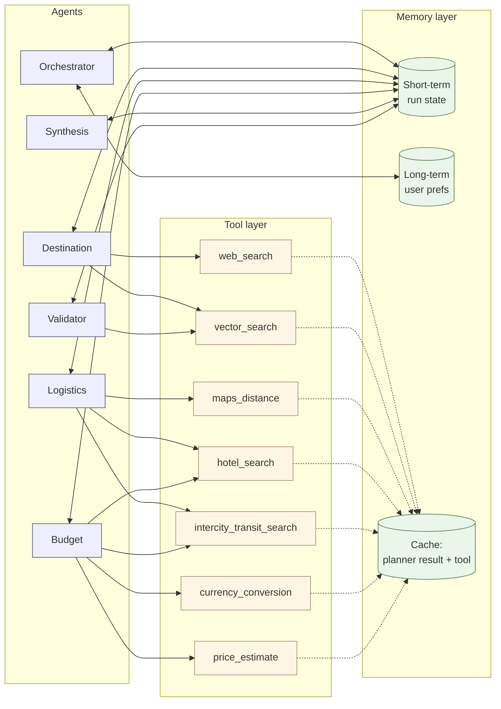

AI Travel Planner — Architecture

Multi-agent system that converts a single natural-language travel request into a realistic, preference-aligned, budget-safe itinerary.
Reference: docs/problemStatement.md

Implementation status

- v1 status:              Delivered. Sections 1–16 describe the as-built v1 system.
- v2 status:              PROPOSED. Section 17 introduces the v2 concierge expansion (origin awareness, flights, hotels with detail, visa, seasonality, maps, PDF, email). Full detail in docs/conciergeProductPlan.md.
- Code home:              `apps/api/` (deployable service), `apps/web/` (UI), `packages/*` (capability layers)
- Build narrative:        docs/implementationPlan.md (Phases 0–10 delivered; v2 Phases V2.A–V2.H planned)
- Test evidence:          94 tests passing across `apps/api/` + every `packages/*/tests/` (run from `apps/api/` via `pytest -q`)
- Mapping summary:        each numbered section ends with an "As implemented" line pointing to the exact package or file that owns it


1. System overview

Orchestrated pipeline of specialist agents coordinated by a single hub.

Components

- Orchestrator parses input, drives the pipeline, merges outputs
- Destination, Logistics, Budget agents produce typed, domain-specific outputs
- Synthesis agent stitches the worker outputs into a day-by-day itinerary
- Validator acts as the final quality gate before returning to the user
- Repair loop routes validation feedback back into the offending worker for a bounded number of revision passes
- Tool layer exposes deterministic, typed wrappers (web search, vector search, maps, hotels, transit, FX, price estimate)
- Memory layer covers short-term run state, long-term user preferences, and a planner-result cache
- Reliability layer wraps the planner with model-tier policy, retry, circuit breaker, and a hardened service envelope

Exit criteria

- Each component has a single clear responsibility
- All cross-component data is typed (`TripBrief`, `Recommendations`, `LogisticsPlan`, `BudgetReport`, `Itinerary`, `RevisionRequest`)

As implemented

- Orchestrator + agent base contract:    `packages/orchestrator/`
- Worker agents (one package each):      `packages/agents/{destination, logistics, budget, synthesis, validator, repair}/`
- Tool layer:                            `packages/tools/`
- Memory layer:                          `packages/memory/`
- Reliability envelope:                  `packages/reliability/`


2. High-level flow

Linear pipeline with one bounded repair loop.

Flow

- Parse:          request text → `TripBrief`
- Specialist:     Destination + Logistics + Budget run as graph nodes
- Synthesise:     merge outputs → `Itinerary`
- Validate:       programmatic + LLM checks → approved or `RevisionRequest`
- Repair:         bounded retry loop only on validation failure

End-to-end

- User Request → Orchestrator → (Destination, Logistics, Budget) → Synthesise → Validator
- Validator approved → Final `Itinerary`
- Validator rejected → Repair loop → targeted re-run of the offending worker

Exit criteria

- Each node receives and returns typed contracts only
- Repair loop is bounded (no infinite retries)

As implemented

- LangGraph state graph + fallback linear runner: `packages/orchestrator/src/orchestrator/graph.py`
- Bounded repair dispatch:                       `packages/agents/repair/src/agents/repair/agent.py`


2.1 Agent flow diagram

End-to-end orchestration with parallel specialist workers and a bounded repair loop.

```mermaid
flowchart LR
    User([User request]) --> Parse[Orchestrator<br/>Parse]
    Parse -->|TripBrief| Fanout((fan-out))

    Fanout --> Dest[Destination agent]
    Fanout --> Log[Logistics agent]
    Fanout --> Bud[Budget agent]

    Dest -->|Recommendations| Synth[Synthesis agent]
    Log  -->|LogisticsPlan|   Synth
    Bud  -->|BudgetReport|    Synth

    Synth -->|Itinerary| Val[Validator<br/>programmatic + LLM]

    Val -->|approved| Final([Final Itinerary])
    Val -->|RevisionRequest| Repair{Retry budget<br/>remaining?}
    Repair -- yes, targeted re-run --> Fanout
    Repair -- no  --> Final

    classDef agent fill:#eef,stroke:#557,stroke-width:1px;
    classDef io    fill:#efe,stroke:#575,stroke-width:1px;
    class Parse,Dest,Log,Bud,Synth,Val agent;
    class User,Final io;
```


2.2 Data flow diagram

Typed contracts as they evolve from raw text to the final artifact. Every arrow is a Pydantic payload defined in `packages/domain_contracts/`.




2.3 Tool and memory wiring

Which agent calls which tool, and how the memory layers are shared across the run.



Exit criteria for the diagrams

- Agent flow matches the `StateGraph` nodes in `packages/orchestrator/src/orchestrator/graph.py`
- Every arrow in the data flow corresponds to a Pydantic schema in `packages/domain_contracts/src/domain_contracts/`
- Every tool in the wiring diagram is registered in `packages/tools/src/tools/registry.py` with a typed wrapper


3. Orchestrator agent

Converts free text into structured constraints and drives the pipeline.

Tasks

- Parse request into a valid `TripBrief` (`destination_country`, `cities`, `duration_days`, `budget_usd`, `preferences`, `avoidances`)
- Drive pipeline: schedule Destination + Logistics + Budget and collect outputs
- Merge results: combine `Recommendations`, `LogisticsPlan`, and `BudgetReport` into an `Itinerary`
- Repair handling: route validator failures into targeted node re-runs only

Exit criteria

- Always emits a typed `TripBrief` for the canonical Japan request
- Produces a complete `Itinerary` before invoking the validator
- Repair loop terminates within a bounded retry budget

As implemented

- Parser:                    `packages/orchestrator/src/orchestrator/parser.py`
- LangGraph state graph:     `packages/orchestrator/src/orchestrator/graph.py`
- Agent base contract:       `packages/orchestrator/src/orchestrator/agents/base.py`
- Run-state type used by graph: `memory.RunStateRecord` (`packages/memory/src/memory/store.py`)


4. Destination agent

Builds a city-level recommendation catalog aligned with user preferences and avoidances.

Tasks

- Sub-query generation from preferences (e.g. quiet temples, less-touristy food streets)
- Retrieval via `web_search` and `vector_search`; merge and de-duplicate
- Tagging: priority (`must_do` or `nice_to_have`), `crowd_level`
- Output: `Recommendations` grouped per city

Exit criteria

- Canonical run includes neighborhoods, experiences, and food per requested city
- Avoidances are reflected in `crowd_level` and item selection
- Output passes `Recommendations` schema validation

As implemented

- `packages/agents/destination/src/agents/destination/agent.py`
  - public surface: `DestinationResearchAgent`, `build_destination_agent`


5. Core data model (shared artifacts)

Typed contracts between agents — single source of truth in `packages/domain_contracts/`.

`TripBrief` (orchestrator output, input to all workers)

- `destination_country`, `cities[]`, `duration_days`
- `budget_usd`, `currency`
- `preferences[]`, `avoidances[]`
- `start_date` (validated against past dates)

`Recommendations` (Destination)

- Per city: `RecommendationItem[]` with `name`, `category`, `priority`, `crowd_level`, `rationale`
- `low_confidence` flag when sources are sparse

`LogisticsPlan` (Logistics)

- `StayAllocation[]`: `city`, `nights` (sums to `duration_days`)
- `IntercityLeg[]`: `from_city`, `to_city`, `mode`, `duration_minutes`, `cost_estimate_usd`
- `DaySkeleton[]`: ordered slot list per day with travel-time annotations

`BudgetReport` (Budget)

- `BudgetCategoryBreakdown`: `stay`, `transport`, `food`, `activities`, `buffer`
- `total_estimate_usd`, `within_budget`
- `BudgetFlag[]` with concrete swap suggestions when over budget or sanity-flagged

`Itinerary` (synthesis output, validator input, also final user-facing artifact)

- `trip_brief`: echoed `TripBrief`
- `day_by_day[]`: ordered day blocks linked to `Recommendations` items
- Embedded `budget_report` summary, neighborhoods, total spend, caveats
- Open assumptions surfaced for the validator

`RevisionRequest` (validator output)

- `approved: bool`
- Programmatic check results (pass / fail per rule, with severity)
- LLM rubric scores with `blocking` vs `advisory` severity
- Routing hints used by the repair loop to dispatch a single worker

Exit criteria

- All payloads validate via Pydantic
- No untyped dicts cross agent boundaries

As implemented

- `packages/domain_contracts/src/domain_contracts/`
  - one module per contract; the package re-exports every model from its `__init__.py`


6. Logistics agent

Converts the recommendation catalog into a realistic day-by-day movement and stay plan.

Tasks

- Stay allocation: nights per city based on `duration_days` and `cities`
- Inter-city movement: mode and duration via `maps_distance` and `intercity_transit_search`
- Day sequencing: order activities to reduce backtracking; respect city handoffs
- Output: `LogisticsPlan` with `stay_plan`, `intercity`, `day_skeleton`

Exit criteria

- `day_skeleton` length equals `TripBrief.duration_days`
- `sum(stay_plan.nights) == duration_days` (guaranteed in constrained scenarios)
- Stay plan covers all requested cities
- Movement legs respect `max_intercity_transfers`

As implemented

- `packages/agents/logistics/src/agents/logistics/agent.py`
  - public surface: `LogisticsPlanningAgent`, `build_logistics_agent`


7. Budget agent

Keeps the trip within budget and provides actionable swap suggestions.

Tasks

- Categorize spend across stay, transport, food, activities, buffer
- Estimate cost: combine baselines, FX, and tool data into category totals
- Compare to budget: set `within_budget` and emit `BudgetFlag` items where needed
- Sanity flags: zero-cost outputs, dominant-category outliers, unrealistic daily spend
- Output: complete `BudgetReport` with totals and flags

Exit criteria

- Returns deterministic numeric output for the same input
- Over-budget runs include at least one concrete swap suggestion
- `within_budget` correctly reflects total vs `TripBrief.budget_usd`

As implemented

- `packages/agents/budget/src/agents/budget/agent.py`
  - public surface: `BudgetPlanningAgent`, `build_budget_agent`


8. Synthesis agent (parallel-merge step)

Implements the core pipeline merge: parallel worker outputs → `Itinerary`.

Tasks

- Receive `Recommendations`, `LogisticsPlan`, `BudgetReport` for the same `TripBrief`
- Resolve "what vs when vs cost" conflicts and link day slots to recommendation IDs
- Embed budget summary and neighborhoods; surface caveats and assumptions
- Output: `Itinerary` ready for the validator

Exit criteria

- One natural-language request produces a coherent `Itinerary`
- `Itinerary.day_by_day` length equals `TripBrief.duration_days`
- Total category spend reconciles with `BudgetReport.total_estimate_usd`

As implemented

- `packages/agents/synthesis/src/agents/synthesis/agent.py`
  - public surface: `ItinerarySynthesisAgent`, `build_synthesis_agent`


9. Validator agent (programmatic + LLM)

Quality gate before user delivery.

Tasks

- Layer 1 — Programmatic: `duration_days` matches day count
- Layer 1 — Programmatic: all required cities appear
- Layer 1 — Programmatic: total estimated spend ≤ `TripBrief.budget_usd` (using `BudgetReport` numbers)
- Layer 2 — LLM rubric: preference alignment, crowd-avoidance effort, narrative coherence, logistics realism
- Layer 2 — LLM output: `RevisionRequest` with blocking vs advisory severity
- If Layer 1 fails, return structured errors; optionally skip or shorten Layer 2

Exit criteria

- Known-bad drafts (wrong city, over budget, wrong day count) fail programmatic checks
- Good demo draft passes with documented checklist on the `RevisionRequest`

As implemented

- `packages/agents/validator/src/agents/validator/agent.py`
  - public surface: `ItineraryValidatorAgent`, `build_validator_agent`


9.1 Repair loop

Targeted re-run of a single worker based on validator feedback.

Tasks

- Map each `RevisionRequest` item to a single offending worker (destination / logistics / budget / synthesis)
- Bounded retries: cap loop iterations; record reason per attempt
- Non-convergence detection: stop early if the same revision signature repeats
- Hand back to the orchestrator either an approved itinerary or a structured "best-effort + unresolved issues" response

Exit criteria

- A failing draft is fixed within `max_retries` or returns a structured error
- No infinite loops under any input

As implemented

- `packages/agents/repair/src/agents/repair/agent.py`
  - public surface: `RepairLoopAgent`, `build_repair_loop_agent`


10. Tool layer

Deterministic, retry-safe wrappers around external capabilities.

Tools

- `web_search`:                open web retrieval for ideas and prices
- `vector_search`:             curated knowledge-base retrieval
- `maps_distance`:             distance and duration between locations
- `hotel_search`:              stay options and indicative pricing
- `intercity_transit_search`:  inter-city transport options and pricing
- `currency_conversion`:       FX conversion for budget math
- `price_estimate`:            heuristic baselines for food and activities

Reliability

- Typed input and output for every tool
- Per-tool retry policy and real-timeout enforcement
- Mock mode (`MOCK_MODE=true`) selectable via settings for tests and offline runs
- Result cache keyed on (tool name, schema version, args)
- Typed error taxonomy (`ToolTimeoutError`, `ToolUpstreamError`, `ToolSchemaError`, …)

Exit criteria

- Every tool has typed I/O, retry policy, and a mock implementation
- Repeated calls hit cache where appropriate
- Strict-real-mode behavior is unit-tested

As implemented

- Runtime + reliability:        `packages/tools/src/tools/tool_runtime.py`
- Registry:                     `packages/tools/src/tools/registry.py`
- Per-tool wrappers:            `packages/tools/src/tools/{web_search,vector_search,maps_distance,hotel_search,intercity_transit_search,currency_conversion,price_estimate}.py`


11. Memory model

Supports per-run coordination and cross-run personalization.

Layers

- Short-term run state: `InMemoryRunStateStore` keyed by correlation ID; shared across graph nodes for one request
- Planner-result cache: `InMemoryPlannerResultCache` (TTL + LRU eviction) keyed on a hash of the `TripBrief`
- Long-term user preferences: `InMemoryUserPreferenceStore` + `UserPreferenceProfile`; opt-in read on parse
- Prompt augmentation: `apply_profile_to_prompt(profile, base_prompt)` injects long-term signals into the parser prompt
- Composed planner: `MemoryAwarePlanner` wraps the orchestrator with cache lookup and run-state persistence

Exit criteria

- Run state is reproducible from a single request payload
- Long-term memory reuse is opt-in and traceable
- Cache TTL + capacity eviction are unit-tested

As implemented

- `packages/memory/src/memory/store.py`
- The in-memory implementations satisfy the same interfaces a future Postgres / Redis / Chroma implementation would satisfy, so swapping is a one-line constructor change.


11.1 Reliability envelope

Production-shape guarantees wrapped around the planner.

Components

- `ModelTierPolicy`:           tier selection and graceful downgrade per call
- `with_retry`:                bounded-retry decorator with exponential backoff
- `CircuitBreaker`:            per-dependency open / half-open / closed state machine
- `HardenedPlannerService`:    composes the above and adds latency budget enforcement and result-shape validation against `domain_contracts`

Exit criteria

- A single tool outage or LLM failure does not crash a run; degraded result is returned with a structured error envelope
- Latency budget breaches are surfaced as a typed error and recorded for observability

As implemented

- `packages/reliability/src/reliability/hardening.py`
- Wired into the API at `apps/api/app/api/trip_planning.py` via `HardenedPlannerService(planner_callable=MemoryAwarePlanner(...).run)`


12. Repository structure

Ownership aligned to domain capabilities; cross-package coupling avoided.

Structure

- `apps/api/`:                       FastAPI integration shell (install, run, tests, CI, `data/`, `scripts/`)
- `apps/web/`:                       Next.js 14 + Tailwind UI client
- `packages/platform/`:              FastAPI app factory, settings, logging, health (Python module: `app_platform`)
- `packages/domain_contracts/`:      Pydantic schemas — single source of truth across the system
- `packages/orchestrator/`:          parser, LangGraph state graph, `Agent` base contract
- `packages/tools/`:                 typed tool layer with retries, cache, real-timeout
- `packages/agents/<capability>/`:   destination, logistics, budget, synthesis, validator, repair
- `packages/memory/`:                run-state, planner-result cache, preference profile, `MemoryAwarePlanner`
- `packages/reliability/`:           tier policy, retry, circuit breaker, `HardenedPlannerService`
- `docs/`:                           problem statement, architecture, implementation plan, file map, changelog

Exit criteria

- Each `packages/<name>/` is self-contained, owns its own `pyproject.toml`, and is installed editably from `apps/api/requirements.txt`
- Integration code in `apps/api/` stays thin and stable (no domain logic leaks into the API service shell)
- Adding a new specialist agent only requires a new `packages/agents/<capability>/` package plus a node entry in the orchestrator graph

As implemented

- `apps/api/requirements.txt` lists 12 editable installs: `platform`, `domain_contracts`, `orchestrator`, `tools`, the six `agents/*`, `memory`, `reliability`
- `apps/api/scripts/mypy_backend.py` walks `packages/` recursively and emits `agents.<capability>` for each PEP-420 namespace child
- `apps/api/pyproject.toml` `[tool.pytest.ini_options].testpaths` includes every `packages/*/tests/`


13. Non-functional requirements

Make the system observable, resilient, and cost-controlled.

Tasks

- Observability: per-run trace IDs, structured JSON logs at every node, optional LangSmith / Langfuse hooks
- Resilience: retries, fallbacks, circuit breakers around tools and LLM calls
- Cost control: model tiering, prompt caching, bounded repair loops
- Extensibility: adding a specialist agent requires only a new package and contract, not pipeline rewrites

Exit criteria

- A single run can be fully traced from request to itinerary
- Failures degrade gracefully with structured errors

As implemented

- Structured logging:                `packages/platform/src/app_platform/structured_logging.py`
- Correlation-ID middleware:         `packages/platform/src/app_platform/request_correlation.py`
- Reliability primitives:            `packages/reliability/src/reliability/hardening.py`
- Bounded repair:                    `packages/agents/repair/src/agents/repair/agent.py`
- Health & readiness:                `packages/platform/src/app_platform/health_routes.py` (checks include `orchestrator` import + `tool_registry` boot)


14. Framework choice

Primary orchestration stack matches the architecture.

Decision

- Primary:        `langgraph` for the agent graph (parse → workers → synthesise → validate → repair)
- Supporting:    `langchain-core` for model and tool abstractions only
- Considered:    CrewAI and AutoGen — rejected as primary due to weaker control over typed state and graph routing

Exit criteria

- Pipeline is implemented as a `StateGraph` with typed state
- Swapping a node (e.g. Validator) does not require pipeline rewrites

As implemented

- `packages/orchestrator/src/orchestrator/graph.py` builds a `StateGraph` and provides a deterministic linear fallback runner used in tests and when `langgraph` isn't installed.
- Each node imports its worker factory lazily (`build_<capability>_agent()`) to keep the graph construction acyclic in dependency terms.


15. Edge cases and failure handling

System must be robust to incomplete inputs, flaky tools, contradictory outputs, and policy constraints.

Input and parsing edge cases

- Missing `duration_days` or `budget_usd`: parser emits defaults + uncertainty flags; validator marks advisory if confidence is low
- Ambiguous city names (e.g. "Springfield"): orchestrator asks a clarification question or uses top-confidence region inference with explicit caveat
- Contradictory constraints (e.g. luxury stay with ultra-low budget): parser separates hard requirements from soft preferences and allows soft downgrades
- Invalid temporal constraints (0 days, negative budget, past `start_date`): fail fast with a structured validation error before agent fan-out

Destination intelligence edge cases

- Sparse results for niche preferences: Destination agent falls back from `vector_search` to broad `web_search` and marks low-confidence recommendations
- Duplicate attractions under alias names: canonicalization + de-dup by normalized place identity and geo proximity
- Avoidance conflicts (quiet + festival week): retain preference intent and annotate unavoidable trade-offs in `rationale`

Logistics edge cases

- Overloaded day plan (travel + too many activities): enforce max daily slot budget and push overflow into optional list
- Infeasible inter-city transfer windows: insert buffer blocks or reallocate nights to maintain temporal realism
- Closed or restricted transport windows: select alternate mode and escalate cost/time impact to Budget and Validator

Budget edge cases

- Partial price availability: mix live tool quotes with heuristics and expose confidence per category
- FX volatility during run: pin a single FX snapshot per run and record timestamp for reproducibility
- Over-budget by unavoidable fixed costs: surface non-negotiable minimum and suggest scope reduction (fewer cities or days)
- Under-budget with high uncertainty: keep a risk buffer rather than spending full residual
- Sanity flags: zero-cost outputs, dominant-category outliers, unrealistic daily spend

Synthesis and validation edge cases

- Cross-agent contradictions (city appears in recs but not stay plan): synthesis performs reconciliation pass and emits `RevisionRequest` on mismatch
- Referential integrity breaks (unknown recommendation IDs in day blocks): programmatic validator fails hard; no user-facing itinerary emitted
- LLM rubric disagreement with programmatic checks: programmatic checks are authoritative for blocking failures
- Repeated repair failures on same rule: stop after retry budget and return structured "best-effort + unresolved issues" response

Tooling, memory, and runtime edge cases

- Tool timeout / rate limit: typed `ToolTimeoutError` / `ToolUpstreamError` with retry + backoff; circuit breaker trips after threshold
- Cache poisoning or stale artifacts: schema/version embedded in cache key; per-tool TTL enforced
- Long-term memory mis-personalization: opt-in only; profile is consulted only when confidence and recency pass thresholds
- Concurrent requests for same user: run state isolated by correlation ID; no cross-run mutation of short-term state
- PII or secrets in logs: structured-log redaction at serializer boundary before persistence

Exit criteria

- Each edge case category has at least one automated test (unit or integration)
- Failures return structured errors with actionable remediation hints
- Best-effort responses are explicitly labeled with confidence and unresolved constraints

As implemented

- Edge-case test files of note:
  - `packages/tools/tests/test_reliability.py` — typed-error taxonomy, real-mode strict guard, timeout enforcement
  - `packages/agents/logistics/tests/test_logistics_agent.py` — `sum(stay_plan.nights) == duration_days`
  - `packages/agents/budget/tests/test_budget_agent.py` — over-budget flagging, all-zero sanity, outlier-share detection
  - `packages/agents/repair/tests/test_repair_agent.py` — bounded retries, non-convergence detection
  - `packages/memory/tests/test_memory_store.py` — TTL eviction, capacity eviction, profile-prompt augmentation
  - `packages/reliability/tests/test_hardening.py` — latency budget, invalid result shape, circuit breaker state transitions
  - `packages/platform/tests/test_smoke.py` — `/healthz` and `/readyz` happy + degraded paths
- See docs/implementationPlan.md "Edge-case coverage delivered" for the full mapping.


16. Evaluation framework (Tier 1/2/3)

Evaluation is now a first-class release gate before enabling real external APIs.

Tier 1 — must-have before real API mode

- Constraint fidelity: city coverage, day count, budget compliance
- Consistency/determinism: repeated identical prompt runs remain stable
- Prompt perturbation: rephrasing/typos preserve core planning outcome
- Repair-loop safety: bounded completion with no infinite retry behavior

Tier 2 — high-value near-term confidence

- Tool failure degradation: synthetic outage yields typed `503` envelope
- Multi-turn context update behavior: revised intent updates planning outcome
- Schema strictness: API response contracts remain structurally valid

Tier 3 — production hardening

- Adversarial prompt resilience: injection strings do not leak system/secret content
- Semantic stability: similar prompts produce similar itinerary signal
- A/B minimal-change sensitivity: tiny wording changes avoid disproportionate drift

Exit criteria

- All tier tests pass in CI-like local run
- Tier 1 failures block real-API enablement
- Tier 2/3 failures require explicit risk acceptance before release

As implemented

- `apps/api/tests/test_eval_tiers.py` contains the full tiered eval suite:
  - 12 tests mapped across Tier 1, Tier 2, Tier 3
  - eval helpers for budget drift, itinerary day count, and semantic overlap
- This suite is included in the full backend test command (`pytest -q` from `apps/api/`), contributing to the current 94 passing tests.


17. v2 concierge expansion (planned, not yet built)

Status: PROPOSED. Awaiting approval per docs/conciergeProductPlan.md. None of the items below are in the current codebase yet; this section captures how they will fit when they ship.

Why this section exists

v1 ships an itinerary generator. v2 turns it into a research-and-planning concierge that walks the user from "I live in Mumbai, I want to go to Vietnam in October" all the way to a personal PDF in their inbox covering visa, flights, hotels with view, local transport, entry fees, season and festival info, and a map. We never book on the user's behalf — every external option carries a `partner_link` to a partner site (Skyscanner, Agoda, Booking.com, 12Go, GetYourGuide, etc.) where the user transacts.

What changes architecturally (high level)

- New domain contracts (in `packages/domain_contracts/`): `PreTripBriefing`, `TimingReport`, `FlightLeg`, `LocalTransportTip`, `EntryFee`, plus extensions to `TripBrief` (origin, dates, travelers) and `Itinerary` (geo markers, partner links)
- New tools (in `packages/tools/`): `flight_search`, `visa_requirements`, `seasonality_calendar`, `attraction_fees`, `local_transport_guide`, `intercity_transport`, `geocoding`, `directions`. Every tool is read-only and populates `partner_options[]` for transactable categories.
- New worker agents (in `packages/agents/`): `pre_trip/` (visa / vaccinations / advisories / packing) and `timing/` (best-month, crowd, festivals); `destination/` and `logistics/` extended; `budget/` extended with explicit flight + entry-fee + local-transport line items
- New endpoints (in `apps/api/`): `POST /api/v1/trips/export/pdf`, `POST /api/v1/trips/email`, plus auth-gated user routes wired to Supabase Auth
- New frontend views (in `apps/web/`): "About your trip" pre-form, `MapPanel`, signup screen with two-checkbox consent, manage-preferences page
- New persistence: Supabase Postgres for `users`, `email_log`, `unsubscribe_tokens`, saved trips (lands in V2.F)

Phase plan (mirrors the v1 phase format)

- V2.A — Origin awareness, traveler profile, trip dates
- V2.B — Real-world tool integrations (flights, visa, season, fees, transport, geocoding)
- V2.C — New / extended worker agents (pre-trip, timing, extensions to existing)
- V2.D — Maps feature (frontend + backend wiring)
- V2.E — PDF export and email delivery (the MVP-launch hook)
- V2.F — Personalization, multi-traveler, saved trips, auth datastore
- V2.G — Live trip mode (in-trip companion)
- V2.H — Hardening, evals, observability for v2

The MVP launch line is V2.A + V2.E + auth + privacy/ToS + DMARC. V2.B through V2.D, V2.F, V2.G, V2.H are post-launch feature drops, each tied to one marketing email to the consenting list.

What stays the same

- Reliability envelope (`HardenedPlannerService`), repair loop, validator, memory layer, and tier-1/2/3 evals continue to wrap every new path
- New tools land behind the existing `BaseTool` interface and `ToolRegistry`; no rewrites
- Suggestion-only product principle is enforced via a `source: "suggestion"` flag and `partner_options[]` on every transactable block, with a new "Suggestion-stance eval" added to the tiered eval suite under V2.H

Cost-aware delivery (student-budget)

The full v2 deliberately uses the free-tier stack documented in docs/conciergeProductPlan.md "Student-budget stack ($0/month)": Vercel + Render + Supabase + Resend + Cloudflare + Gemini Flash + OpenStreetMap (Nominatim) + OpenWeatherMap. Paid flight/hotel APIs are explicitly delayed; deep-links to partner search URLs cover the gap at zero cost.

As planned

- Full plan, gap analysis, GTM strategy, launch ladder, and 3-day Student-Pack prep window: docs/conciergeProductPlan.md
- v2 phase narrative with Goal / Tasks / Exit-criteria per phase: docs/implementationPlan.md "Roadmap — v2 concierge expansion"
- v2 file-map preview (where new packages will live once shipped): docs/projectFileMap.md "v2 expansion preview"
